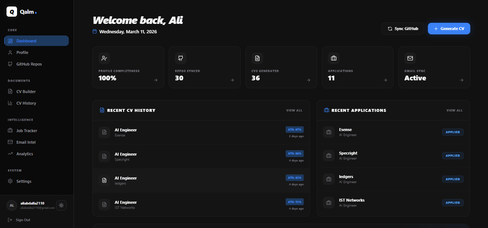
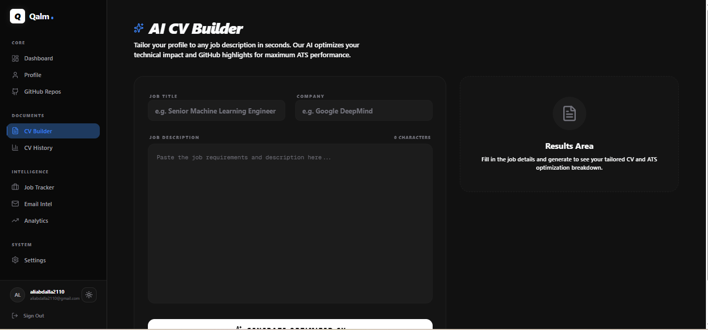
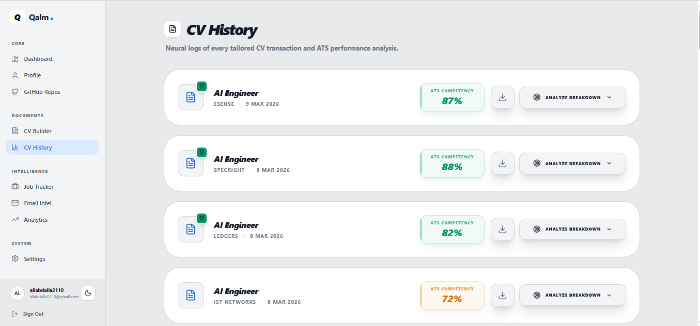
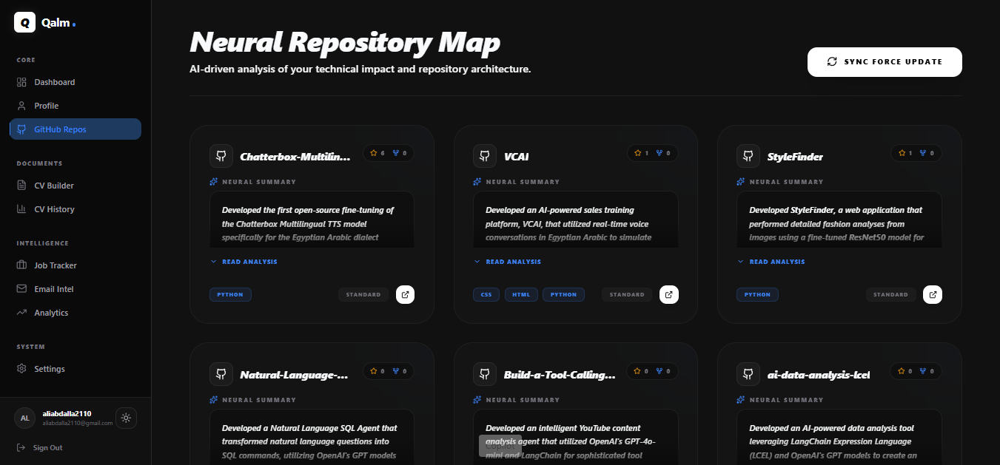
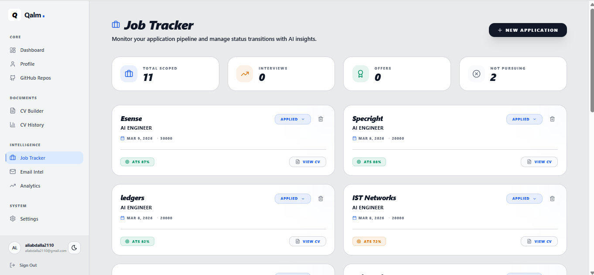
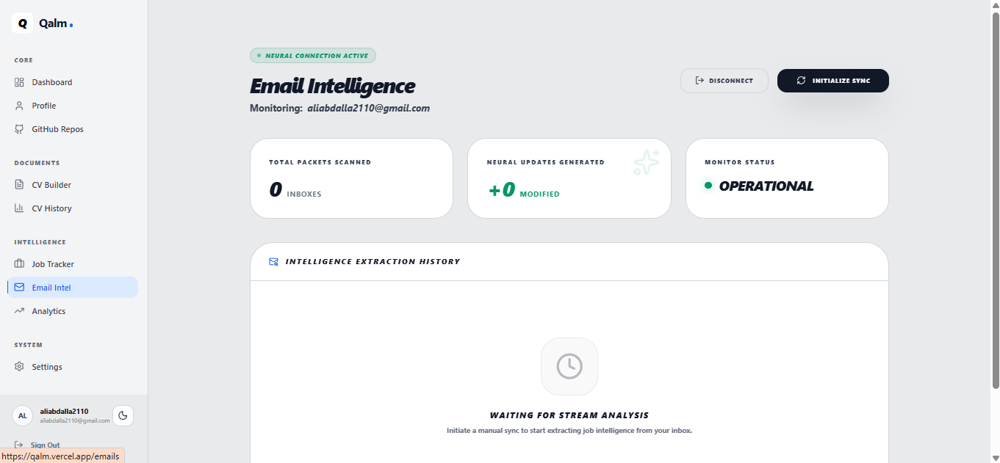
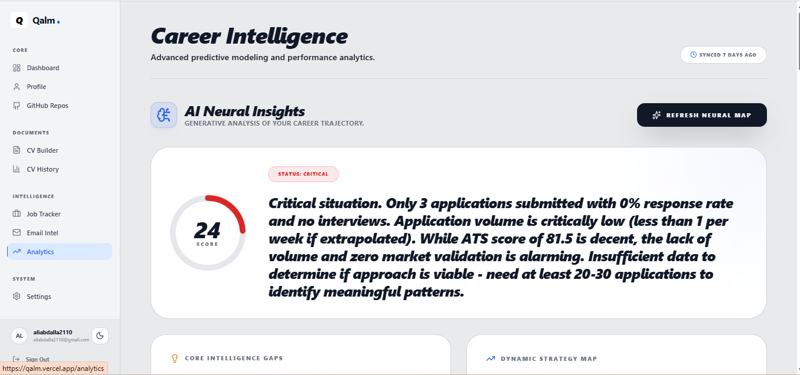
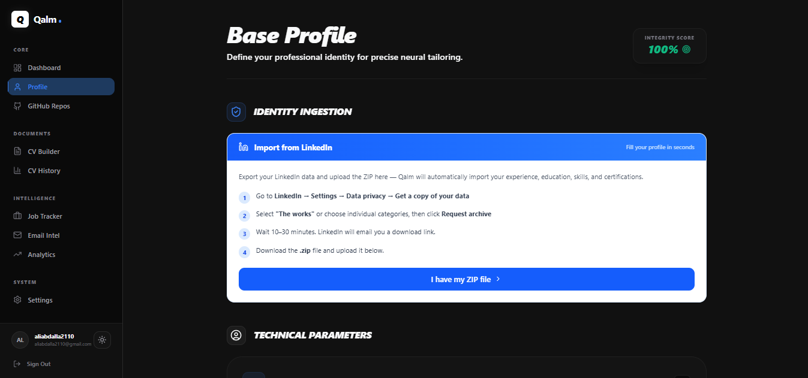
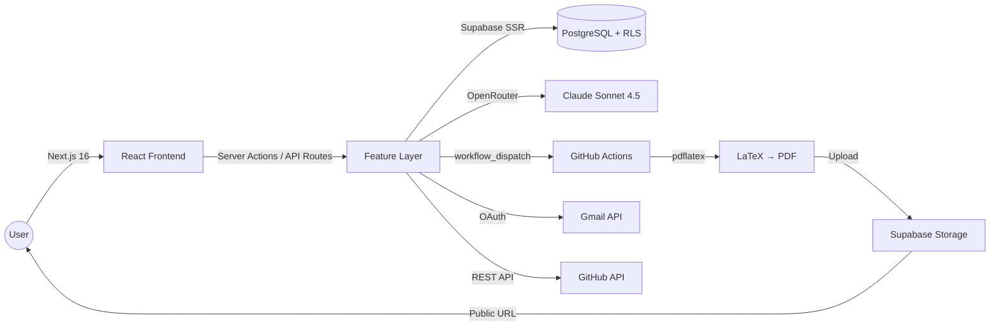

# ✒️ Qalm — قلم

<div align="center">

**Stop sending the same CV to every job. Start getting replies.**

[](https://qalm.vercel.app)
[](https://nextjs.org/)
[](https://www.typescriptlang.org/)
[](https://tailwindcss.com/)
[](https://supabase.com/)
[](https://opensource.org/licenses/MIT)

<br/>

*Qalm (Arabic قلم — "pen") is an AI-powered career assistant.*
*Fill your profile once. Paste any job description. Get a tailored, ATS-optimized CV as a downloadable PDF — in seconds.*

<br/>



</div>

---

## 🚀 What is Qalm?

Most job seekers send the same CV everywhere and wonder why they get no replies. Qalm fixes that.

You build your profile once — experience, education, skills, GitHub repos, certifications. Then for every job you apply to, you paste the job description and Qalm's AI engine (powered by Claude Sonnet) generates a fully tailored CV that matches the exact keywords the ATS is scanning for, compiled into a pixel-perfect PDF via a real LaTeX engine.

Beyond CV generation, Qalm tracks your applications, monitors your Gmail inbox for interview invites and rejections, and gives you AI-driven career analytics — all in one place.

---

## ✨ Features

### 🤖 AI CV Generation
Paste a job description and get a fully tailored CV in seconds. Claude Sonnet analyzes your profile against the job requirements and restructures your experience to maximize ATS match score.



### 📊 ATS Score Breakdown
Every generated CV comes with a detailed ATS competency score. See exactly which keywords matched, which are missing, and how your CV ranks against the job description.



### 🐙 GitHub Repository Sync
Connect your GitHub account and Qalm AI-summarizes your repositories — turning raw code into professional impact statements that get embedded directly into your CV.



### 📋 Job Application Tracker
Track every application in one place. Monitor status transitions (Applied → Interview → Offer), see your ATS score per application, and access the exact CV you sent.



### 📧 Email Intelligence
Connect Gmail once. Qalm scans your inbox and automatically classifies emails from companies you've applied to — detecting interview invites, rejections, and offers, and updating your job tracker automatically.



### 📈 Career Analytics
AI-powered career intelligence. Get a holistic score of your job search, identify gaps in your strategy, and receive actionable recommendations based on your application history.



### 🔗 LinkedIn ZIP Import
Export your LinkedIn data and upload the ZIP — Qalm automatically populates your entire profile: experience, education, skills, and certifications in one step.



### 📝 Cover Letter Generation
Generate tailored cover letters for any job description using the same profile data that powers your CV.

### 🌗 Light / Dark Mode
Full theme support with a polished UI in both light and dark modes.

---

## 🏗️ Architecture



**Key design decisions:**
- All AI calls go through a single `callAI()` wrapper with model aliasing — no hardcoded model strings anywhere
- Row Level Security on every Supabase table — users can only ever access their own data
- PDF compilation runs on GitHub Actions (Ubuntu + TeX Live) — no server-side LaTeX dependency
- Feature access is gated through a single `canUserAccess()` function

---

## 🛠️ Tech Stack

| Layer | Technology | Version |
|---|---|---|
| Framework | Next.js App Router | 16.1.6 |
| Language | TypeScript | 5 |
| Styling | Tailwind CSS | v4 |
| Database / Auth / Storage | Supabase (PostgreSQL + RLS) | `@supabase/ssr ^0.9.0` |
| AI Provider | OpenRouter | — |
| AI Models | Claude Sonnet 4.5 · GPT-4o-mini · Claude Opus 4.5 | — |
| PDF Engine | GitHub Actions + TeX Live (`pdflatex`) | — |
| Icons | Lucide React | ^0.576.0 |
| Charts | Recharts | ^3.7.0 |
| Payments | Stripe | ^20.4.0 |
| Deployment | Vercel | — |

---

## 🚀 Getting Started

### Prerequisites

- Node.js 18+
- A [Supabase](https://supabase.com) project
- An [OpenRouter](https://openrouter.ai) API key
- A GitHub OAuth App
- A Google Cloud project (for Gmail integration)

### 1. Clone the repository

```bash
git clone https://github.com/AliAbdallah21/qalm.git
cd qalm
```

### 2. Install dependencies

```bash
npm install
```

### 3. Configure environment variables

```bash
cp .env.example .env.local
```

Fill in all values in `.env.local`. See [Environment Variables](#-environment-variables) below for details on where to get each one.

### 4. Apply database migrations

In your [Supabase SQL Editor](https://supabase.com/dashboard), run each migration file in order:

```
supabase/migrations/001_initial_schema.sql
supabase/migrations/002_add_languages.sql
supabase/migrations/003_add_cover_letters.sql
supabase/migrations/004_add_ats_breakdown.sql
supabase/migrations/005_add_gmail_tokens.sql
supabase/migrations/006_add_analytics_reports.sql
supabase/migrations/007_add_pdf_compilation_fields.sql
```

### 5. Configure GitHub Actions secrets

PDF compilation runs via GitHub Actions. In your repository go to **Settings → Secrets and variables → Actions** and add:

| Secret | Value |
|---|---|
| `SUPABASE_URL` | Your Supabase project URL |
| `SUPABASE_SERVICE_KEY` | Your Supabase service role key |

### 6. Configure Supabase Auth

In your Supabase dashboard go to **Authentication → URL Configuration** and set:
- Site URL: `https://your-domain.vercel.app`
- Redirect URLs: `https://your-domain.vercel.app/auth/callback`

Also enable **GitHub** as an OAuth provider under **Authentication → Providers**.

### 7. Start the development server

```bash
npm run dev
```

Open [http://localhost:3000](http://localhost:3000).

---

## 🔐 Environment Variables

| Variable | Required | Where to get it |
|---|---|---|
| `NEXT_PUBLIC_SUPABASE_URL` | ✅ | Supabase → Settings → API |
| `NEXT_PUBLIC_SUPABASE_ANON_KEY` | ✅ | Supabase → Settings → API |
| `SUPABASE_SERVICE_ROLE_KEY` | ✅ | Supabase → Settings → API (keep secret) |
| `DATABASE_URL` | Optional | Supabase → Settings → Database |
| `GITHUB_CLIENT_ID` | ✅ | GitHub → Settings → Developer Settings → OAuth Apps |
| `GITHUB_CLIENT_SECRET` | ✅ | GitHub → Settings → Developer Settings → OAuth Apps |
| `GITHUB_ACTIONS_TOKEN` | ✅ | GitHub → Settings → Personal Access Tokens (workflow scope) |
| `GITHUB_PAT` | ✅ | GitHub → Settings → Personal Access Tokens |
| `GITHUB_REPO_OWNER` | ✅ | Your GitHub username |
| `GITHUB_REPO_NAME` | ✅ | Your fork's repository name |
| `OPENROUTER_API_KEY` | ✅ | [openrouter.ai/keys](https://openrouter.ai/keys) |
| `NEXT_PUBLIC_APP_URL` | ✅ | `http://localhost:3000` locally, your domain in production |
| `GOOGLE_CLIENT_ID` | Gmail | Google Cloud Console → Credentials → OAuth 2.0 |
| `GOOGLE_CLIENT_SECRET` | Gmail | Google Cloud Console → Credentials → OAuth 2.0 |
| `GOOGLE_REDIRECT_URI` | Gmail | `https://your-domain.vercel.app/api/emails/callback/gmail` |
| `STRIPE_SECRET_KEY` | Payments | [dashboard.stripe.com/apikeys](https://dashboard.stripe.com/apikeys) |
| `NEXT_PUBLIC_STRIPE_PUBLISHABLE_KEY` | Payments | [dashboard.stripe.com/apikeys](https://dashboard.stripe.com/apikeys) |
| `STRIPE_PRO_PRICE_ID` | Payments | Stripe → Products → Your Pro plan |
| `STRIPE_WEBHOOK_SECRET` | Payments | Stripe → Webhooks → Signing secret |

---

## 📁 Project Structure

```
qalm/
├── .github/
│   └── workflows/
│       └── compile-pdf.yml     # LaTeX PDF compilation pipeline
├── src/
│   ├── app/
│   │   ├── (auth)/             # Login, signup pages
│   │   ├── (dashboard)/        # All protected dashboard pages
│   │   └── api/                # API route handlers
│   ├── features/               # Business logic — one folder per feature
│   │   ├── cv-generator/       # CV generation, ATS breakdown
│   │   ├── profile/            # Profile CRUD
│   │   ├── github/             # GitHub sync
│   │   ├── job-tracker/        # Application tracking
│   │   ├── email-intel/        # Gmail OAuth + email classification
│   │   ├── cover-letter/       # Cover letter generation
│   │   ├── analytics/          # Career intelligence
│   │   └── subscriptions/      # Tier management
│   ├── lib/
│   │   ├── ai/                 # OpenRouter client + all prompt constants
│   │   ├── supabase/           # Server & browser Supabase clients
│   │   ├── access/             # canUserAccess() — single feature gate
│   │   ├── github/             # GitHub API wrapper
│   │   └── email-providers/    # Gmail OAuth implementation
│   └── components/             # Shared UI components
└── supabase/
    └── migrations/             # SQL migration files — schema as code
```

---

## 🔄 CV Generation Flow

```
User pastes job description
  → POST /api/cv/generate
  → Fetch full profile from Supabase
  → Fetch featured GitHub repos
  → callAI({ model: 'smart' }) → Claude Sonnet 4.5 via OpenRouter
  → AI returns structured CV JSON + ATS breakdown
  → Generate LaTeX source string
  → Dispatch GitHub Actions workflow (compile-pdf.yml)
  → Ubuntu runner: install TeX Live → pdflatex × 2
  → Upload PDF to Supabase Storage (bucket: cvs)
  → Update cv_generations: pdf_status = 'ready', pdf_url = ...
  → Client polls status → User downloads PDF
```

---

## 🗄️ Database Schema

7 sequential migrations covering 10 tables:

| Table | Purpose |
|---|---|
| `profiles` | Core user profile data |
| `experiences` | Work experience entries |
| `education` | Education entries |
| `skills` | Skills with proficiency levels |
| `languages` | Language proficiency |
| `certificates` | Certifications with credential URLs |
| `github_repos` | Synced and AI-summarized repositories |
| `cv_generations` | CV history with ATS scores and PDF URLs |
| `job_applications` | Job application tracker |
| `gmail_tokens` | Gmail OAuth tokens (encrypted at rest) |

All tables have Row Level Security enabled — users can only access their own rows.

---

## 🚢 Deployment

Qalm is deployed on [Vercel](https://vercel.com). Every push to `main` triggers an automatic deployment.

1. Fork this repository
2. Import to Vercel
3. Set all environment variables in Vercel → Settings → Environment Variables
4. Set `NEXT_PUBLIC_APP_URL` to your Vercel deployment URL
5. Update Supabase Auth redirect URLs to your deployment URL
6. Push to `main` — Vercel deploys automatically

**PDF compilation** runs on GitHub Actions (not Vercel) — make sure `SUPABASE_URL` and `SUPABASE_SERVICE_KEY` are set as GitHub repository secrets.

---

## 📬 Author

**Ali Abdallah** — AI/ML Engineer & Full-Stack Developer

[](mailto:aliabdalla2110@gmail.com)
[](https://www.linkedin.com/in/ali-abdallah-b5ba792b6/)
[](https://github.com/AliAbdallah21)

---

## 🛡️ License

Distributed under the MIT License. See `LICENSE` for more information.

---

<div align="center">
  <sub>Built with Claude Sonnet, Next.js, and a lot of LaTeX debugging.</sub>
</div>