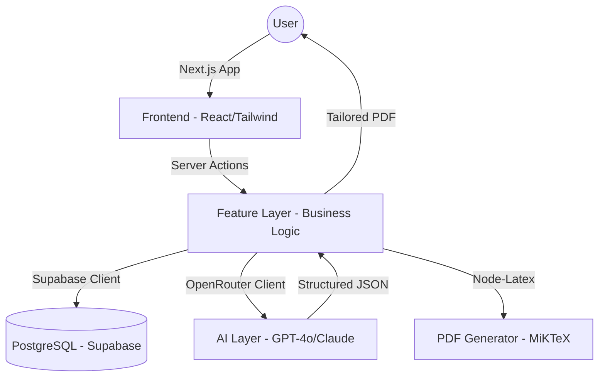

# ✒️ Qalm (قلم)
### One profile. Infinite tailored applications.

[](https://opensource.org/licenses/MIT)
[](https://nextjs.org/)
[](https://www.typescriptlang.org/)
[](https://supabase.com/)

**Qalm** (Arabic for "pen") is a sophisticated AI-powered career assistant built to eliminate the tedious, repetitive work of job applications. Instead of manually reformatting your CV for every role, Qalm learns your entire professional history once and uses advanced LLMs to generate perfectly tailored, high-impact application materials in seconds.

---

## 🎯 The Problem & Our Vision

Most job seekers spend **40-60% of their "applying time"** simply re-editing their CV to match job descriptions. Even then, they often:
- Miss critical ATS (Applicant Tracking System) keywords.
- Fail to highlight their most relevant projects for a specific role.
- Submit generic cover letters that don't tell a compelling story.

**Qalm's vision** is to provide a "Universal Professional Identity." You manage one rich, deep profile, and Qalm handles the translation of that identity into whatever format a specific employer needs—be it a customized CV, a targeted cover letter, or a project portfolio.

---

## 🚀 Phase 2 Features (Current)

Qalm is currently in **Phase 2**, offering a robust suite of tools for the modern job seeker:

### 📄 Intelligent CV Generation
- **AI Tailoring**: Uses OpenRouter (GPT-4o/Claude 3.5) to rewrite bullet points and reorder skills based on the Job Description (JD).
- **LaTeX PDF Export**: Generates professional, clean, and consistent PDFs using a refined LaTeX template (banking style).
- **Strict 1-Page Enforcement**: Intelligent content compression and rule-based generation to ensure your CV stays punchy and readable.

### 📊 ATS Intelligence
- **Keyword Breakdown**: Visual indicator of matched vs. missing keywords from the JD.
- **Score Visualizer**: Color-coded ATS compatibility score (0-100%).
- **Improvement Tips**: AI-generated actionable advice to improve your profile-to-job match.

### 🧩 Data Integration & Import
- **LinkedIn ZIP Import**: Parse your entire LinkedIn export (Positions, Education, Skills, Certs) in one click.
- **GitHub Sync**: Connect your GitHub and let AI summarize your repositories into professional project entries.

### 📝 Career Management
- **Job Application Tracker**: Keep track of every company, role, status, and salary expectation in one place.
- **Cover Letter Generator**: High-impact letters that tell the story your CV can't, tailored to the specific company's tone.
- **CV History**: Re-download or review every tailored CV you've ever sent.

---

## 🏗️ Technical Architecture

Qalm is built with a focus on modularity, type safety, and AI performance.



- **Frontend**: Next.js 16 (App Router), Tailwind CSS, Lucide Icons.
- **Backend**: Next.js Server Actions & API Routes (Node.js).
- **Database**: Supabase PostgreSQL with Row Level Security (RLS) for absolute data privacy.
- **AI Engine**: OpenRouter integration allows for dynamic model swapping (GPT-4o-mini for speed, Claude 3.5 Sonnet for quality).
- **Type Safety**: 100% TypeScript with shared interfaces between frontend, backend, and AI prompts.

---

## 🛠️ Getting Started

### Prerequisites
- [Node.js 18+](https://nodejs.org/)
- [MiKTeX](https://miktex.org/) (required for local PDF generation)
- [Supabase Account](https://supabase.com/)
- [OpenRouter API Key](https://openrouter.ai/)

### Installation

1. **Clone the Repo**
   ```bash
   git clone https://github.com/AliAbdallah21/qalm.git
   cd qalm
   ```

2. **Install Dependencies**
   ```bash
   npm install
   ```

3. **Configure Environment**
   Create a `.env.local` file:
   ```env
   NEXT_PUBLIC_SUPABASE_URL=your_supabase_url
   NEXT_PUBLIC_SUPABASE_ANON_KEY=your_supabase_anon_key
   SUPABASE_SERVICE_ROLE_KEY=your_service_role_key
   NEXT_PUBLIC_GITHUB_CLIENT_ID=your_github_id
   GITHUB_CLIENT_SECRET=your_github_secret
   OPENROUTER_API_KEY=your_openrouter_key
   ```

4. **Database Migrations**
   Apply the migrations in `supabase/migrations/` to your Supabase instance to set up the schema and RLS policies.

5. **Start Developing**
   ```bash
   npm run dev
   ```

---

## 🛡️ License

Distributed under the MIT License. See `LICENSE` for more information.

---

## 📬 Contact & Connect

**Ali Abdallah** - AI/ML Engineer & Full-Stack Developer

- **Email**: [aliabdalla2110@gmail.com](mailto:aliabdalla2110@gmail.com)
- **LinkedIn**: [linkedin.com/in/ali-abdallah-b5ba792b6/](https://www.linkedin.com/in/ali-abdallah-b5ba792b6/)
- **GitHub**: [github.com/AliAbdallah21](https://github.com/AliAbdallah21)

Project Link: [https://github.com/AliAbdallah21/qalm](https://github.com/AliAbdallah21/qalm)

---

### 🌟 Roadmap
- **Phase 3**: Gmail integration for auto-tracking of application status via AI email scanning.
- **Phase 4**: Advanced career analytics and skill gap analysis tool.
