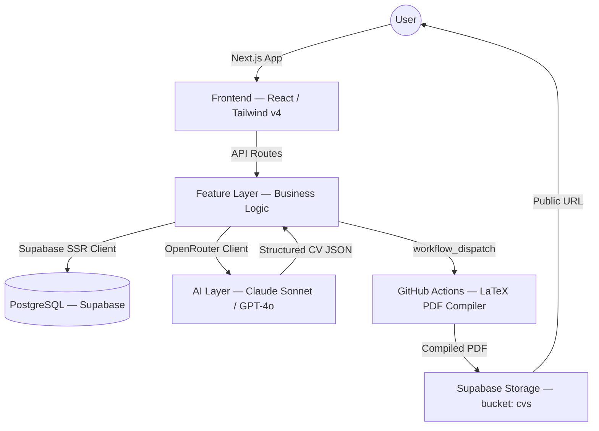

# ✒️ Qalm (قلم)

> **One profile. Infinite tailored applications.**

[](https://qalm.vercel.app)
[](https://nextjs.org/)
[](https://www.typescriptlang.org/)
[](https://tailwindcss.com/)
[](https://supabase.com/)
[](https://opensource.org/licenses/MIT)

**Qalm** (Arabic قلم — "pen") is an AI-powered career assistant. Fill your professional profile once, paste any job description, and receive a tailored, ATS-optimized CV as a downloadable PDF in seconds — compiled by a real LaTeX engine for pixel-perfect output.

🔗 **[qalm.vercel.app](https://qalm.vercel.app)**

---

## ✨ Features

| Feature | Status |
|---|---|
| 🤖 AI CV Generation (Claude Sonnet via OpenRouter) | ✅ Live |
| 📊 ATS Score Breakdown (matched/missing keywords) | ✅ Live |
| 🐙 GitHub Profile Sync (AI-summarized repos) | ✅ Live |
| 📋 Job Application Tracker | ✅ Live |
| 📧 Email Intelligence (Gmail OAuth — auto-detects interviews, rejections, offers) | ✅ Live |
| 📝 Cover Letter Generation | ✅ Live |
| 🔗 LinkedIn ZIP Import | ✅ Live |
| 📈 Analytics Dashboard | 🚧 In Progress |
| 🌗 Light / Dark Mode | ✅ Live |
| 📄 PDF Compilation via GitHub Actions + LaTeX | ✅ Live |

---

## 🏗️ Architecture



---

## 🛠️ Tech Stack

| Layer | Technology | Version |
|---|---|---|
| Framework | Next.js App Router | 16.1.6 |
| Language | TypeScript | 5 |
| Styling | Tailwind CSS | v4 |
| Database / Auth / Storage | Supabase (PostgreSQL + RLS) | `@supabase/ssr ^0.9.0` |
| AI Provider | OpenRouter | — |
| AI Models | Claude Sonnet 4.5 (`smart`), GPT-4o-mini (`fast`), Claude Opus 4.5 (`best`) | — |
| PDF Engine | GitHub Actions + TeX Live (`pdflatex`) | — |
| Payments | Stripe | ^20.4.0 |
| Icons | Lucide React | ^0.576.0 |
| Charts | Recharts | ^3.7.0 |
| Deployment | Vercel | — |

---

## 🚀 Getting Started

### 1. Clone the repo

```bash
git clone https://github.com/AliAbdallah21/qalm.git
cd qalm
```

### 2. Install dependencies

```bash
npm install
```

### 3. Configure environment variables

```bash
cp .env.example .env.local
```

Open `.env.local` and fill in all values. See [Environment Variables](#-environment-variables) below.

### 4. Apply database migrations

In your [Supabase dashboard](https://supabase.com/dashboard), open the SQL editor and run each file in order from `supabase/migrations/`:

```
001_initial_schema.sql
002_add_languages.sql
003_add_cover_letters.sql
004_add_ats_breakdown.sql
005_add_gmail_tokens.sql
006_add_analytics_reports.sql
007_add_pdf_compilation_fields.sql
```

### 5. Configure GitHub repository secrets

The PDF compilation runs via GitHub Actions. In your forked repo settings (**Settings → Secrets and variables → Actions**), add:

| Secret | Value |
|---|---|
| `SUPABASE_URL` | Your Supabase project URL |
| `SUPABASE_SERVICE_KEY` | Your Supabase service role key |

### 6. Start the dev server

```bash
npm run dev
```

Open [http://localhost:3000](http://localhost:3000).

---

## 🔐 Environment Variables

Copy `.env.example` to `.env.local` and fill in each value:

| Variable | Required | Description |
|---|---|---|
| `NEXT_PUBLIC_SUPABASE_URL` | ✅ | Supabase project URL |
| `NEXT_PUBLIC_SUPABASE_ANON_KEY` | ✅ | Supabase anon (public) key |
| `SUPABASE_SERVICE_ROLE_KEY` | ✅ | Supabase service role key (server-only) |
| `DATABASE_URL` | Optional | Direct PostgreSQL connection string |
| `GITHUB_CLIENT_ID` | ✅ | GitHub OAuth App client ID |
| `GITHUB_CLIENT_SECRET` | ✅ | GitHub OAuth App client secret |
| `GITHUB_ACTIONS_TOKEN` | ✅ | GitHub PAT with `workflow` scope (for PDF dispatch) |
| `GITHUB_PAT` | ✅ | GitHub Personal Access Token |
| `GITHUB_REPO_OWNER` | ✅ | Your GitHub username |
| `GITHUB_REPO_NAME` | ✅ | Repository name (e.g. `qalm`) |
| `OPENROUTER_API_KEY` | ✅ | OpenRouter API key |
| `NEXT_PUBLIC_APP_URL` | ✅ | App base URL (`http://localhost:3000` locally) |
| `GOOGLE_CLIENT_ID` | Phase 3 | Google OAuth client ID (Gmail integration) |
| `GOOGLE_CLIENT_SECRET` | Phase 3 | Google OAuth client secret |
| `GOOGLE_REDIRECT_URI` | Phase 3 | Google OAuth redirect URI |
| `STRIPE_SECRET_KEY` | Phase 4 | Stripe secret key |
| `NEXT_PUBLIC_STRIPE_PUBLISHABLE_KEY` | Phase 4 | Stripe publishable key |
| `STRIPE_PRO_PRICE_ID` | Phase 4 | Stripe Price ID for the Pro plan |
| `STRIPE_WEBHOOK_SECRET` | Phase 4 | Stripe webhook signing secret |

---

## 📁 Project Structure

```
src/
├── app/
│   ├── (auth)/          # Public routes: login, signup
│   ├── (dashboard)/     # Protected routes: all dashboard pages
│   └── api/             # API route handlers
├── features/            # Business logic — one folder per feature
│   ├── cv-generator/    # types, queries, actions
│   ├── profile/
│   ├── github/
│   ├── job-tracker/
│   ├── email-intel/
│   ├── cover-letter/
│   ├── analytics/
│   └── subscriptions/
├── lib/
│   ├── ai/              # OpenRouter client + prompt constants
│   ├── supabase/        # Server & browser Supabase clients
│   ├── access/          # canUserAccess() — feature/tier gate
│   ├── github/          # GitHub API wrapper
│   └── email-providers/ # Gmail provider implementation
└── components/          # Shared UI components
supabase/
└── migrations/          # SQL migration files (schema as code)
.github/
└── workflows/
    └── compile-pdf.yml  # LaTeX PDF compilation pipeline
```

---

## 🗺️ Roadmap

- **Phase 1** ✅ — Core MVP: profile, GitHub sync, AI CV generation, PDF download
- **Phase 2** ✅ — LinkedIn import, cover letter, job tracker, ATS breakdown
- **Phase 3** ✅ — Gmail integration: auto-classify emails, update job tracker
- **Phase 4** 🚧 — Analytics dashboard, skill gap analysis, Stripe Pro tier

---

## 📬 Author

**Ali Abdallah** — AI/ML Engineer & Full-Stack Developer

- 📧 [aliabdalla2110@gmail.com](mailto:aliabdalla2110@gmail.com)
- 💼 [linkedin.com/in/ali-abdallah-b5ba792b6](https://www.linkedin.com/in/ali-abdallah-b5ba792b6/)
- 🐙 [github.com/AliAbdallah21](https://github.com/AliAbdallah21)

---

## 🛡️ License

Distributed under the MIT License.
